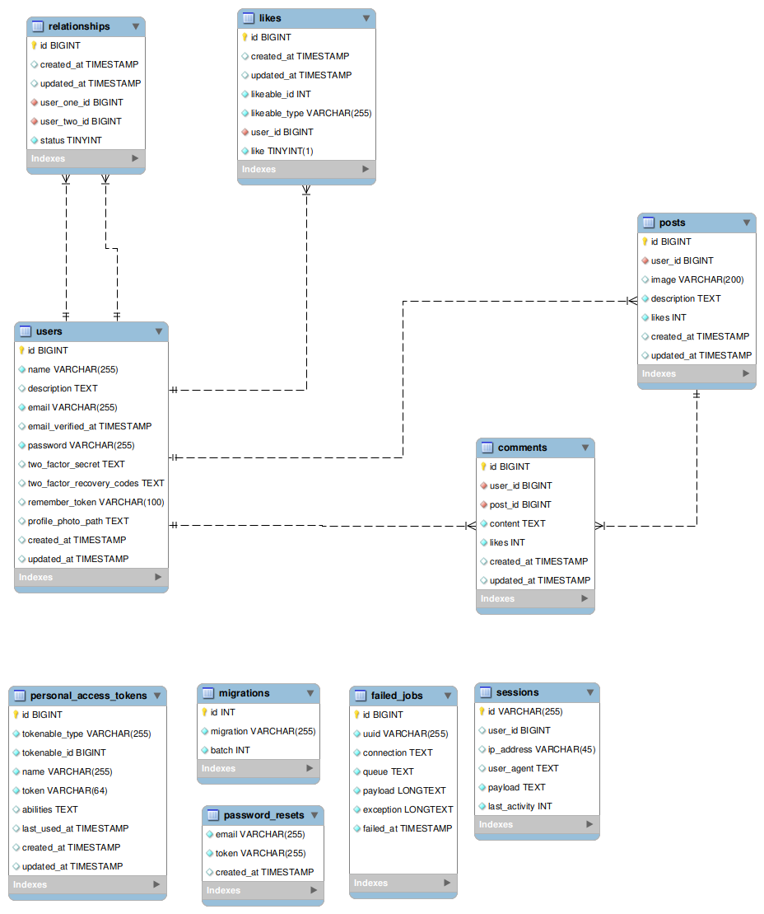

 

#   Social network with laravel

 

 

Authors : *Bernat and Luis*

 

## About WeShare

 

We share is a social network developed with Laravel   and carrying  all of the traditional social network features , plus a robust back-end that keeps user data save.  The user  can create and edit posts with a text content and an image. It can also write comments and add likes to their posts or the people he is friend with. Hence, the user can send friendship requests to other users  and also block users he or she does not want to interact with. 

 

## Project structure

 

The project is developed in PHP, JavaScript and sass. It follows the MVC pattern  where the  entities and views are connected  through a common controller. 

 

### Database 

 

The database has been optimized in order to contain the minimum  number of tables possible and yet perform all the desired tasks . The relationships table stores the friendship status between the users. The column `user_one` corresponds to the emitter of the request whilst the column `user_two` will be the receiver. The column `status`  represents the request status. Those are the following possible status.

 

* 0 -> Request has been send, but its pending for the user_two to answer.
*  1-> Request accepted. user_one and user_two are friends.  They can see and interact with each other's posts respectively 
* 2 -> Request declined.  user_one sent a friendship request but user_two declined it.
* 3 -> User blocked. user_one has blocked user two. Hence  it will appear for the user_two as if the user_one did not exist at all.

   

The users table stores the users that registered the application . The posts and comments table store posts and comments respectively and the likes table stores the like a user has made to a comment or post.  The reader may wonder why is it that there is no relation between likes table and posts/comments. The reason is that in that case we defined  a polymorphic relationship between likes and comments/posts. Doing it so, the likes table has a `likeable_id`, which may reference to posts or comments, depending on the model  path defined in `likeable_type`.  Such relationships  can be defined within the laravel framework, but are generally not understood by the databases themselves. 

 

 

### CONTROLLERS

 

As we know, the controllers are in charge of connecting the model with the views of the page. In this project we used the ones written below.

 

##### <u>User controller</u>

As a social network is based on the user, our most important controller is the  `userController`  where the functions connecting the user with their posts comments or friends will be defined .  Such controller is called to obtain the posts to be displayed, by order of creation and properly paginated. Depending on a parameter within the request, this function can be use for retrieving posts based on one user or based on the content written in the search-box.

 

##### <u>post controller, comment controller</u>

 

Those two controller present similarities, as both are based on a CRUD the user can perform. The following command  gives the default functions to create a proper CRUD controller . Both the comments and the posts are retrieved dynamically through  a JavaScript document that detects whenever the user is near the end of the document, adding another page at the bottom

 

` php artisan make:controller --resource`

 

##### <u> like controller</u>

 

The like controller adds or removes likes based on JavaScript queries made by the user when he/ or she presses the like button. This controller updates the  table likes on one hand and adds/removes one like in the post or comment that has been liked on the other hand. 

 

### MODELS

 

The models have no secret once we have explained  the controllers to we  have in our project. For each controller we talked about, there is one model that  acts as a single access to the entity it represents.  Those are:  Comment, Like,Post,Relationship and User.

 

### ROUTES

 

Most of the routes are defined at  `routes/web.php `  The endpoints defined here are;

 

**<u>To user controller</u>**

 

GET: 

 

`/user/{username}`  -> show an user profile
 

`/user/notifications/all `-> get user notifications
 

`/user/friends/all` -> get user friends

 

POST: 

 
`/user/request/{id}`-> send a request to another user
 

`/user/respond/{id}` ->  send a response request to a user
 

`/user/block/{id}` -> block a user
 

`/user/search/all` -> search post content or user by adding '@' at first
 

 `/posts/page` -> obtain a subset of the posts  depending on the variables 'offset, limit,content and group'

 

**<u>To post controller</u>**

 

GET:  

 

`/posts/new`      	 ->  get view for creating a post

 
`/posts/edit/{id}`	 ->  get view for editing a post
 

`/posts/comments/{postId}` -> obtain a view with the comments of the post

 

POST

 

`/posts/create` -> create a post
 

`/posts/update/likes` ->update post likes
 

`/posts/update/{id}` -> edit a post

 
`/posts/delete/{id}` -> delete a post

 

**<u>To comments controller</u>**

 

POST

 
`/comments/create`-> create a comment

 

**<u>To like controller</u>**

 

GET

 
`likes/{likeable}/{id}` -> toggle like of the user within a post or comment

 

**<u>To user profile controller</u>**

 

GET

 
`/user/profile` -> get user settings view

 

**<u>Retrieve other views</u>**

 

`/home `-> retrieve home page

`/ `-> default page, retrieve welcome page

`/login` -> retrieve login page

 

### MIDDLEWARES

 

In order to ensure that users get the right content displayed, only can edit or delete their own posts and can't track users that have been blocked by them, we created the following middle-wares

 

* checkBlocked.php -> This middleware is applied whenever one user looks for another one or tries to send a request on him. If the user did block him,  it will appear as if it did not exist at all.

  

   

* checkComment -> This middleware is applied whenever the user writes a comment on a given post. We want to make sure that indeed, the  post that is being commented belongs to a friend or to the user itself , and not another user that has no relation with him.

  

 

* checkFriendStatus -> When we visit a user's profile, an option will display depending on the relation we hold with that person. For instance , if it figure in our friendlist,  the available option will be *remove friendship* . This middleware checks that the action of removing the friend is compatible with the relationship that the two users hold . If the user wants to remove a friendship that does not exist at all in the first place, this middleware will stop him from doing it so. It will also prevent the user to create a relationship with himself.

  

   

  

* checkUserId -> When editing or deleting a post, this middleware checks that the post indeed belongs to the user.

  

 

### VIEWS

 

The views have been created using the blade template and the tailwind library. The login functionality and the user settings have been done by using jetstream.

 

The  views have been structured as modular as possible, all coming from a common layout named app .  Also, all those components that responded to a concrete feature have been defined in  separated files under the folder   `components` inside `views` . An example are the comments, which are on one hand called when the posts are rendered but also  updated every five seconds. Also the modals are defined that way, so those can be reused troughout the application. 

 

### TOOLS

 

Besides the predefined folders made by laravel, we have created  `tools` inside the app folder. Here  we define a class  with static methods named `arrayTools` . Those functions have to do with looping through arrays , but their functionality can be extracted from any controller and thus, be used throughout the code. An example is a function sorting objects by the property `created_at` which  is useful at different stages of our code. Another one is the function that adds mentions given a text, finding the names starting with `@` and substituting those with  a link redirecting to the user profile. This function is both needed for posts and comments, so does not belong to any of those two controllers , but accessible by both.

 

## JS MODULES

 

<u>**app.js**</u>

 

The main js document is `app.js` which is included in the root php document named also app.  Here, functionalities needed in all the views are defined. For instance, the  message functionality needed whenever we want to communicate to the user. Also , as the navbar is available in almost all views, their functionality is implemented here. 

<u>**modals.js**</u>

 

This module  has defined the functionality for all the modals. It is included within the app document.

 

<u>**newPost.js**</u>

 

This module stores the functionality to upload an image in the post. It is only  called in newPost  and editPost views.

 

<u>**post.js**</u>

 

Functionality to retrieve paginated posts, update likes and comments and add likes. Used in profile and home views.  

 

### STYLES

 

The styling has been done to  great extend in the same php document using the tailwind library. Nonetheless,  some styles have been applied using  sass style-sheets.  The files are the followings.

 

* _animations.scss  . File for storing  animations applied  when rendering the webpages.
* _components.scss. Separated components like mixings, functions and utils.
* _friendsList.scss. Styles used for the friendsList view.
* _layout.scss.  Styles for cards and containers.
* _newPost.scss. Styles for the newPost view.
* _profile.scss . Styles or the profile view.
* _variables.scss Color variables , font weights and mobile screen size .
* home.scss. Main style-sheet where all the others are included.  It also carries navigation bar styles and styles for the posts.

 

### TESTING
 

A  Dusk test has been applied to check that the login functionality works as expected.  It can be found under `tests/LoginTest.php`

 

